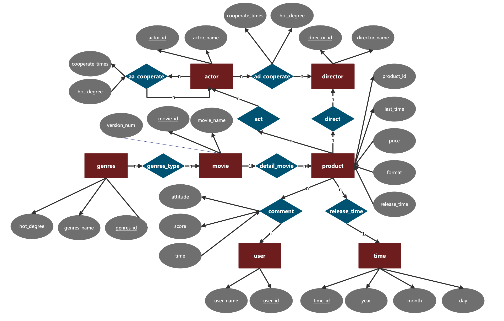
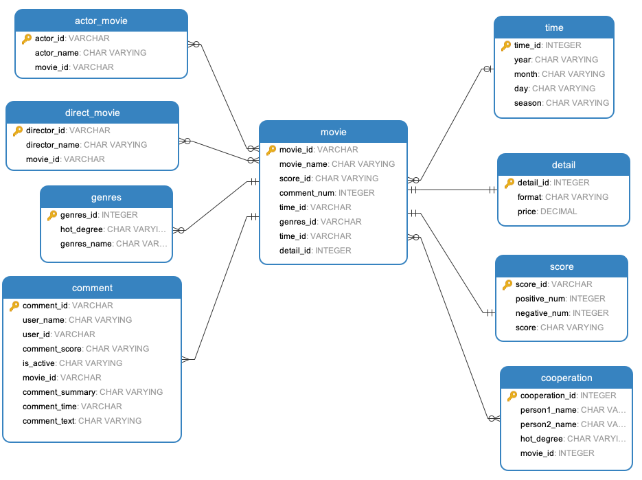

### 关系型数据库

查询要求和思考如下，如果要执行下述组合查询列出来了可以有的查询方式，以及通过这些查询方式应该如何涉及LDB和PDB：

- 按照时间进行查询及统计（例如XX年有多少电影，XX年XX月有多少电影，XX年XX季度有多少电影，周二新增多少电影等）
  - 查询XXXX年发行的电影产品对应的电影，返回电影名称、评分，并按照评分由高到低排序。
  - 查询XXXX年XX月发行的电影产品对应的电影，返回电影名称、评分，并按照评分由高到低排序。
  - 查询XXXX年XX季度发行的电影产品对应的电影，返回电影名称、评分，并按照评分由高到低排序。
  - 查询每一年发行的电影产品数量，返回年份和该年的电影产品数量，并按照年份先后排序。
  - 查询XXXX年每个月发行的电影产品数量，返回月份和该月的电影产品数量，并按照月份先后排序。
  - 查询每一天发行的电影产品数量与新增数量

> 这涉及到了电影的属性和时间的关系，时间需要包括年，月，日，需要通过时间来查询电影

- 按照电影名称进行查询及统计（例如 XX电影共有多少版本等）
  - 查询电影《XXX》的电影产品，返回ASIN号、发布时间、格式、类型、Amazon网址，版本号，并按照发布时间先后排序。
  - 查询电影《XXX》的基本信息，返回电影名称、产品数量、导演数量、演员数量、评论数量、评分。
  - 查询电影《XXX》的参演演员，并按照首字母A-Z排序。
  - 查询电影《XXX》的导演，并按照首字母A-Z排序。

> 这涉及到了电影名称查询电影的语句，以及电影需要与导演，演员，评论之间有所关联

- 按照导演进行查询及统计（例如 XX导演共有多少电影等）
  - 查询XX导演所执导的电影，返回电影名称、评分，并按照电影评分由高到低排序。
  - 查询XX导演自导自演的电影，返回电影名称、评分，并按照电影评分由高到低排序。
  - 查询执导过至少X部电影的导演，返回导演名称、执导电影数量、执导电影平均评分，按照执导过的电影数量从高到低排序。
  - 查询执导电影数量较多的导演，返回导演名称、执导电影数量、执导电影平均评分，并按照执导电影数量由高到低排序。
  - 查询自导自演电影数量较多的导演，返回导演名称、自导自演电影数量，并按照自导自演电影数量由高到低排序。
  - 查询参与最多电影数量较多的导演，返回导演名称、参与电影数量，并按照参与电影数量由高到低排序。

> 这涉及到了导演名称与电影之间的关系，包括统计电影数量，统计电影演员和导演之间的关系等

- 按照演员进行查询及统计（例如 XX演员主演多少电影，XX演员参演多少电影等）
  - 查询XX演员所参演的电影，返回电影名称、评分，并按照电影评分由高到低排序。
  - 查询参演过至少X部电影的演员，返回演员名称、参演电影数量、参演电影平均评分，按照参演过的电影数量从高到低排序。
  - 查询参演电影数量较多的演员，返回演员名称、参演电影数量、参演电影平均评分，并按照参演电影数量由高到低排序。

> 这涉及到了演员名称与电影之间的关系，包括统计电影数量，统计电影与相关评论的信息等

- 按照电影类别进行查询及统计（例如 Action电影共有多少，Adventure电影共有多少等）
  - 查询XXX类别的电影，返回电影名称、评分，并按照评分由高到低排序。
  - 查询最受欢迎的电影类别，返回电影类别、电影类别包含的电影产品数量，并按照电影类别包含的电影产品数量由高到低排序。
  - 查询最小众的电影类别，返回电影类别、电影类别包含的电影产品数量，并按照电影类别包含的电影产品数量由低到高排序。

> 这涉及到了电影类别查询电影的语句，可以事先制定一个分类体系，根据分类来查询相关电影数量信息等，以及类别的受欢迎程度

- 按照用户评价进行查询及统计（例如用户评分3分以上的电影有哪些）
  - 查询用户评价X分以上的电影，返回电影名称、评分，并按照评分由高到低排序。

> 这涉及到了用户评价和电影之间的关系，通过统计电影所有的用户评价评分，可以通过对于评分的筛选得到电影组合

- 按照演员、导演之间的关系进行查询及统计（例如经常合作的演员有哪些；经常合作的导演和演员有哪些；如果要拍一部XXX类型的电影，最受关注（评论最多）的演员组合（2人，3人等）是什么？）
  - 查询和XX合作过的演员，返回演员名称、合作次数，并按照合作次数由多到少排序。
  - 查询和XX合作过的导演，返回导演名称、合作次数，并按照合作次数由多到少排序。
  - 查询经常合作的演员，返回演员组合{A，B}、合作次数，并按照合作次数由多到少排序。
  - 查询经常合作的演员和导演，返回演员导演组合{A，B}、合作次数，并按照合作次数由多到少排序。
  - 查询合作的演员和导演组合的热度，即通过评论数量来衡量，按照热度从高到低排序

> 这涉及到了演员，导演之间的交叉关系，演员和演员之间合作的次数，演员和导演之间合作的次数；以及合作组合和评论数之间的关系，评价好坏之间的关系

- 组合查询：即应用上述多种查询方式

通过分析可得，要求存储有关电影基本信息，演员信息，导演信息，评分信息，时间信息，用户评价信息等多个维度的信息，对数据库涉及的操作仅为大量高并发查询，因此关系型数据库可以为以冗余的存储来提高查询的效率。因此使用星型模式进行关系型数据库的结构组织。这是很常见的维表来巩固颗粒列在最冗余数据，并因此在提供第二范式 。事实表中通常第三范式，因为所有的数据取决于他们其中任何一个方面或所有方面，而不是少数的一对组合。

星型模式**是非规范化的**，在星型模式的设计开发过程中，不受应用于事务型关系数据库的范式规则的约束。他的优点是简化查询。查询数据时，从上面的分析可以得到，我们需要的查询大多是从某一个属性或者维度出发进行查询；获得查询性能。星型模式可以提升只读报表类应用的性能。但是他的缺点是不能保证数据完整性。一次性地插入或更新操作可能会造成数据异常，而这种情况在规范化模型中是可以避免的。星型模式的数据装载， 一般都是以高度受控的方式，用批处理或准实时过程执行的，以此来抵消数据保护方面的不足。

和雪花型模式如果做对比的话，星型模型因为数据的冗余所以很多统计查询不需要做外部的连接，因此一般情况下效率比雪花型模型要高。星型结构不用考虑很多正规化的因素，设计与实现都比较简单。雪花型模型由于去除了冗余，有些统计就需要通过表的联接才能产生，所以效率不一定有星型模型高。正规化也是一种比较复杂的过程，相应的数据库结构设计、数据的 ETL、以及后期的维护都要复杂一些。因此在冗余可以接受的前提下，实际运用中星型模型使用更多，也更有效率。

### LDM

通过上面的分析，可以绘制E- R图

可以使用电影事实表存储电影主要数据，包括两类信息，一类是数值信息，另外一类为维度信息。其中数值信息仅包括如电影名称、电影持续时间、电影ASIN等仅与电影本身属性有关的信息，维度属性不直接存储数据，而是存储维度表的外键值。

除事实表外，维度表存储各个维度的属性值。本星型模式具有包括时间维度、演员维度、导演维度、电影类别维度、电影评价维度、产品详情维度，人物合作关系维度，电影分数维度八张维度表，每个维度表都将与具有维度值的事实表中列相关联，存储有关该维度的附加信息。

由于使用的是星型模型，针对上述的E- R图将movie和product合并（原来product指的是movie的具体版本或者具体信息），而改为movie和detail，分别作为事实表和维度表；user和comment也进行了合并；actor和director，actor和actor之间的合作关系也进行了合并成一个表，得到了下面这张星型模式图：

### PDM

关系型存储采用了MySQL，MySQL是现在最为常用几种关系型数据库之一，它对比其他的几种大型商业数据库来说，如Oracle， DB2和Sybase，非常的简单易用，同时MySQL的性能也非常稳定，很少出现宕机，同时也易于维护，安装。

在数据库表中，即按照LDM所分析的，分为一个事实表和8个维表，在各个表中存储了基础的冗余信息，便于查询操作，比如在电影表中存储了其电影的评论数量信息、在导演和演员的表中存储了其演过的电影的信息，在时间表中存储了季度的信息，在电影风格表中存储了评论热度的信息。然后按照表的上述的LDM设计了数据库，创建了9个表如下，具体内容见附件：

