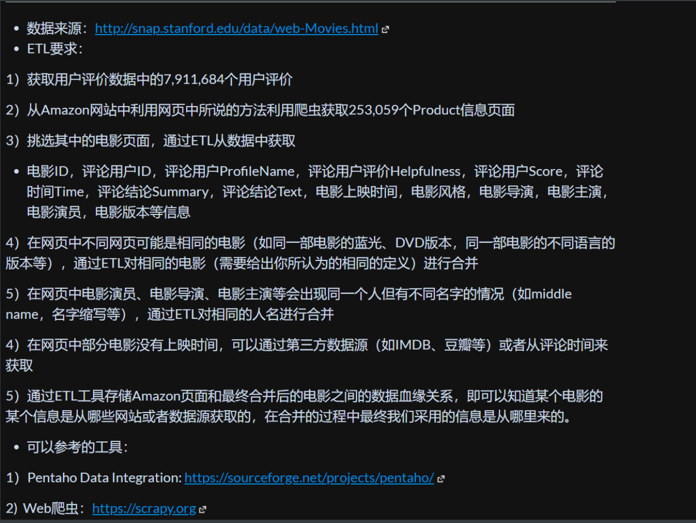
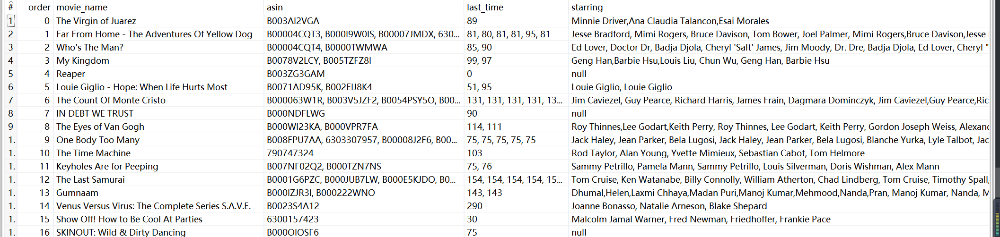

### 大概思路


4.将相同的电影进行合并——利用ETL

5.对电影中相同的人名进行合并——利用ETL

7.存储最终结果得到数据血缘关系——利用ETL



### 数据集

#### Amazon数据集

此步骤是完成第（1）步的内容，获取了用户评价数据中的7,911,684个用户评价。从网站http://snap.stanford.edu/data/web-Movies.html上下载数据，然后解压查看数据格式，如下所示：


观察数据格式，数据格式如下，可以看到主要是`productId` 和`review`，下一步需要做的就是通过`productId`到Amazon网站上来获取`product`的具体页面，从而和`review`产生联系，构造一个新的电影数据集。

```
product/productId: B00006HAXW
review/userId: A1RSDE90N6RSZF
review/profileName: Joseph M. Kotow
review/helpfulness: 9/9
review/score: 5.0
review/time: 1042502400
review/summary: Pittsburgh - Home of the OLDIES
review/text: I have all of the doo wop DVD's and this one is as good or better than the
1st ones. Remember once these performers are gone, we'll never get to see them again.
Rhino did an excellent job and if you like or love doo wop and Rock n Roll you'll LOVE
this DVD !!
```

经过`python`对于重复的`productId`进行筛选后（主要是利用集合结构自动去重），得到253,059个`URL`,存储到`data1.txt`中，其`python`代码如下，见附录代码1：

随机抽取了几个页面查看，格式大多如下面两种，例如对于`asin`为`B003AI2VGA`和`asin`为`1594350167`的，前者详情页`URL`为`https://www.amazon.com/dp/B003AI2VGA`，他是`Prime Video`，页面如下，可以通过点击详情页的链接从而进入到其他形式`other formats`页面，下面三图分别为初始页，`URL`跳转页，以及跳转过后的商品页：


前者通过链接跳转过后的商品页是和后者一样的，所以可以先对后者页面进行爬取，前者页面进行筛选后再用另一个爬取项目进行爬取。后者`URL`为`URL`为`https://www.amazon.com/dp/1594350167`，即直接进入正常的商品页面，所需要获取的数据大多在`Product details`中，即在第二张图中，因此通过`scrapy`解析即可：


通过分析需要从此页面得到的信息有ASIN，电影名字，上映时间，电影类型，电影导演，电影主演，语言，电影持续时间，分别为：`asin,movie_name，release_time,movie_type,director,starring,language,last_time`。通过`python`的`scrapy`框架对其进行爬取，对于第二类和第一类都统一进行爬取，第一类按照目前写的爬虫规则是爬不到东西的，所以`asin`只有第二类的信息，在进行筛选过后，可以将第一类没有被爬取的页面再重新写规则进行爬取，

使用`scrapy`框架，在`setting.py`中将`USER_AGENT`中设置为网页火狐端浏览器访问（这里也可以设置几个浏览器头进行随机访问），`ITEM_PIPELINES `设置为300，第一类爬取出来的数据存储到`Asin_Info.csv`中，由于之前并未接触过爬虫，因此做法可能比较繁重：

- 之前得到的`data1.txt`文件包含着全部商品的`asin`，通过拼接成`URL`利用`scrapy`进行循环读取
- 在解析页面的过程中，获取方式为`css选择器`,对于每一个页面就构造一个`SracpyasinItem()`用来存储信息
- 在解析页面的过程中，发现有些字段比如标题最后尽管用`strip`去除，但是不知道是什么字符，通过字符串之间的比较也无法显示，最终还是无法判断并且存入`excel`中，因此采取了直接去除最后两个字符的做法
- 由于爬取数据过多，因此为了提高`scrapy`的爬取效率，默认`scrapy`开启的并发线程为32个，可以适当进行增加，也就是在`CONCURRENT_REQUESTS`中将值设为100；在运行`scrapy`时，会有大量日志信息的输出，为了减少CPU的使用率，设置`log`输出信息为`INFO`，也是在配置文件中修改；对于失败的`HTTP`后面会与源数据对比在此再次进行分析爬取，因此可以禁止重试，在配置文件中`RETRY_ENABLE=False`；对于一个非常慢的链接进行爬取，减少下载超时，在配置文件中编写`DOWNLOAD_TIMEOUT=10`。

下面是主要代码，见附录代码2：

在获得输出的表格后，发现有的网页需要验证码，以及还有一些反爬虫的机制，比如IP信誉监控，机器人验证码和`PhantomJS`等，还有的错误是只能返回标题，中间的内容信息得不到，对此猜测可能是改变了页面格式，下面是机器人验证码的页面：


经过网上查找资料和进行实验，得到了在`header`里面有`cookie`的时候会稳健很多，但是即使有`cookie`短时间内多次请求还是会被防，因此考虑使用`cookie`，简历一个`cookie-userangent`的列表，每次访问随机使用一组，但是还是不可避免会被反爬，由于能力有限，因此采用八爪鱼采集器中的亚马逊模版来进行尝试，但是采集字段和要求不符，同时也采用了其他的爬虫工具，但都不符合要求，最终在`github`上找到相似的项目，采用`Selenium`（即一个自动化网页测试库）能够通过控制浏览器来爬取数据，因此验证码弹出的频率大幅度降低，有效提高了爬虫的成活率。

上述第二类数据的爬取已经完成，存储于`AsinInfor.xls`文件中，截图如下，经过筛选得到一些网站并没有得到任何数据，这一类网站有些网站是由于反爬机制而导致的不能被爬取，有些网站是第一类网站，再次进行筛选，针对未获取到的数据网站进行爬取，并针对第一类网站再次编写爬虫程序获得其数据集，再与第二类的拼接起来：

第一类的网站经过分析，发现可以得到`movie_type`，即电影类型，因此将原来的属性定义为`format`，通过此次爬取得到的属性为`movie_type`，解析的主要代码如下，见附录代码3：

得到的数据集存储到`AsinInfor2.xls`中，最终将两者拼接，得到数据集`AsinInfor_final.xls`，得到数据如下：


#### IMDB数据集

对于`Amazon`数据集获取的原因，有可能出现有电影名称但是没有电影上映时间的问题（当然，这也可以从评论时间来获取），因此采用第三方数据源作为补充，构造完整的数据集，因此考虑爬取IMDB数据集，为以后的使用做准备，同样是使用`scrapy`框架来构造数据集（此代码为`github`上一个`IMDB scrapy`代码项目的复现，将`IMDB`网站上的数据进行分类爬取，分别得到不同类型电影的具体信息，主要代码和数据格式如下，代码见附录代码4：


#### 豆瓣数据集

采用豆瓣数据集的目的和`IMDB`一样，同样是借鉴`github`上的项目，根据豆瓣每个影片的链接地址后，可以在豆瓣电影的筛选所有地区的影片，并获取其id；然后通过id构建并爬取该影片链接，获得其导演、主演、类型、片长、评分等信息。这两步其实和获得`Amazon`的数据集是一样的，只是前一步在`Nest`网站已经获得了数据省略掉了，关于反爬等问题同样也是寻找网上的解决方法进行解决，见附录代码5：

利用`translate`包将中文翻译为英文，主要代码如下，见附录代码6：

最终整理，得到豆瓣数据集格式如下：


#### 数据集总结

至此，已经完成了所有数据集的收集如下：


但是此数据集存在一些问题：

- 豆瓣数据集和IMDB数据集存在格式不统一的问题，由于豆瓣数据集的英文名称是通过`python`自带的翻译直接翻译的，所以会产生一定的误差，电影名称可能对不上号，后续需要在发布时间或者是时长进行对比分析，另外豆瓣数据集中有些电影名称是不存在的，此数据集也存在一定的缺陷
- `ASIN`数据集具有时间格式不统一的问题，以及导演，演员可能会重复，电影提取重复的问题，这需要后续进行数据清洗处理
- 就像作业中所要求的那样，`Amazon`的数据集有些是缺失的，需要利用其他数据集对其进行补充处理

### 挑选电影产品

根据观察电影产品的数据特征以及采用评论数据集中的评论特征和根据`github`上的相关资料，可以得到以下规则来划分该产品是电影产品还是非电影产品。

- 根据产品的目录即可以先排除不是电影产品，例如一级目录不是`Movies & TV`的，即不是电影产品
- 根据评论中的文字信息，如果评论中含有关于电影相关的关键字较多，则认为是电影产品，否则则认为不是。其中判断关键字的标准为观察法和统计法：电影关键字为` Movie(s), theater(s), Hollywood, Bollywood`，非电影关键字为 `（教程）to teach you, instructor(s), instruction(s), technique(s) （连续剧）episode(s), season, series   （纪录片）documentary, doc, BBC, series `
- 根据产品的名称，如果名称中有` Analysis of , technique ,Collection `的，大概率不是电影
- 根据产品时⻓，如果产品`release time`小于30min或者大于300min，则认为该产品大概率不是电影 
- 根据产品类型，这是产品的二级目录，通过分析`Amazon`产品的目录结构可知，如果产品类型为`Bollywood ，Movies` ，则认为该产品一定为电影。如果产品类型字段中包含`Boxed Sets，TV，Exercise，Special Interest，PBS`以及`CDs&Viny`下的类型，则认为该产品一定不是电影 

由于判断的条件还缺乏一定的科学依据，因此采用记分法，即对于每条`asin`有相应的不是电影的记分，得分越大，即认为越可能不是电影，采用`python`脚本进行筛选，其主要代码如下，这里主要利用了字典的数据结构，得到的数据得分如下，再进行一定的转换将其放入表格中，根据界定范围的一定误差（与其他数据做参考），在界定范围之上认为是非电影的产品，在界定范围之前认为是非电影产品，最终得到 203567个电影类型Product，除去47472个非电影类型Product ：

注：此步骤根据ETL也可以获得，即对于数据进行字符串替换等操作，然而由于采用的是记分规则，因此采用`python`更为方便，即采用编写`python`程序的方式来判断分类，见附录代码7：


### 创建数据库

此步是后来加的，原本以为ETL处理表格数据的功能已经足够了，但是还是需要连接存储到数据库中操作更加方便也更加符合预期，因此分别创建`Amazon,豆瓣,IMDB`的数据的表，过程如下：

- 用Darabase Configuration Assiant创建一个新的库

  

- 在sql developer中进行连接

  

- 分别在表格中导入数据

  

  

- 

### ETL

#### 数据预处理

得到上述的电影产品之后，是利用`PDI`进行清洗，首先是对于`Amazon数据集`的清洗，例如去除特征中包含的中文字符和乱码，使其统一格式、去除产品名称中的各种括号和其中的乱码或者其他文字的内容、有一些的`Director`需要是`Writer`的需要进行统一改进，同时也会有同一个演员但是名字缩写可能不同于是被判断成不同演员的情况

- 将产品名字规范化，除了产品名称之外的中括号，小括号等符号可以去除掉，这一步可以使用转换步骤，采用字符串替换利用正则表达式除掉括号内容；


- 接下来是日期的问题，有些产品的日期不存在（这个后面用豆瓣数据集和IMDB数据集来补充），而且产品之间的日期格式也不一致，所以将日期分为年，月，日更加便于处理以及后续的补充，因此采用拆分字段的转换来进行字段的拆分，通过观察数据格式可以得到日期格式未空的数据，如果没有年月日，就只有年份，一般是4个数字，如果有年月日的数据，中间是以横杠来连接，可以以此来作为拆分，过滤和拆分步骤如下，然后将两个表格合并，得到的两个表格如下：


上述操作总共得到一个合并后处理了电影名称和日期格式的表格，其ETL转化图和分别的表格如下，然后再将表格合并：


#### 电影合并

接下来是对于电影的合并，不同的网页有可能是相同的电影，比如同一个电影的蓝光，DVD版本，同一部电影的不同语言版本等。电影是否为同一个电影主要是根据以下几个方面：

- 电影的名称，同一部电影的名称大多是相似的，因此可以采用判断其名称是否相似，语言问题暂时没有考虑，大多数是英文
- 电影的导演，同一部电影的导演应该有共同点，因此可以作为判断条件
- 电影的演员，可以列举电影的演员，然后进行电影的比对，如果相似多则可以认为很有可能是一个电影
- 电影的时长，如果两部电影的时长在上述要求都符合的条件下，误差在半个小时之内（有可能是删减版），则认为很有可能是同一部电影
- 不能作为判断的依据：电影的发布时间，因为有可能是不同的版本之类，总而言之，满足上述要求即可认定为“相同”

但是第一个步骤，也就是电影的名称我在`Kettle`没有找到合适的转换，因此第一个步骤采用`python`程序来实现，这里主要采用邻接表的数据结构，电影名称相似度达到90%以上则认为两个电影名称非常相似（这里的相似度判断采用`python`的` difflib.SequenceMatcher `），可以进入同一条邻接线，最终通过邻接表找到属于相同一类的电影即可（当时想法是这样，但是最终就是用了列表的结构来实现），主要代码如下，同一个电影则放入同一个列表中，最终再放入表格中转换，代码见附录代码8：


将用`python`根据电影名称判断得到可能是相同的电影标相同的序号，再放入`Kettle`中对相同序号（也就是很大可能是一样的电影）的电影进行后续判断，主要步骤如下：

可以采用分组按照序号来组合，然后根据不同的判断因素，即导演，演员，时长来分别作为判断的依据：



- 首先是根据时长，每一个`order`组别代表了一组可能相同的电影，在`last_time`的数值内用逗号分隔的数据（有的产品没有时长）个数即为时长，可以判断数据之间的差异性，相互之间小于30即认为是一部电影，特别离群的点则可以剔除该组

- 然后是根据导演
- 然后是根据时长

#### 演员合并

### 获取电影放映时间

这里有三个来源，一个是豆瓣的电影集，一个是imdb的电影集，一个是评论时间。首先筛选没有放映时间的电影的名称，对于豆瓣和imdb的电影集都是通过查看名称的相似度来继续配对筛选的。首先对于豆瓣数据集进行配对，如果豆瓣数据集中也不存在相映电影的时间，或者没有配对的电影，则继续进行mdb电影数据集的配对。将最后存储出来的数据放入字典中，然后打印出来给excel进行处理。

如果上述根据电影名称配对其放映时间之后仍然有电影没有放映时间，则根据asin然后根据评论时间来继续配对。根据的原则是评论时间最早的则认为该时间就是放映时间，同样也是用字典存储，然后放入到原数据集当中。主要的`python`代码如下，最后得到数据格式如下，代码见附录代码9：

```
'B003AI2VGA': '2006-11-22',
'B00006HAXW': '2004-04-22',
'B00004CQT3': '2000-07-30'
```

### 数据之间的血缘关系

#### 理论分析

数据血缘属于数据治理中的一个概念，是在数据溯源的过程中找到相关数据之间的联系，它是一个逻辑概念。数据治理里经常提到的一个词就是血缘分析，血缘分析是保证数据融合的一个手段，通过血缘分析实现数据融合处理的可追溯。大数据数据血缘是指数据产生的链路，直白点说，就是我们这个数据是怎么来的，经过了哪些过程和阶段。任何的数据，从产生、ETL处理、加工、融合、流转，到最终消亡，数据之间自然会形成一种关系。好比人类社会中的人际关系，类似的一种关系来表达数据之间的这种关系，称之为数据的血缘关系。从技术角度来讲，数据a通过ETL处理生成了数据b，那么，我们会说，数据a与数据b具有血缘关系。不过与人类的血缘关系略有不同，数据血缘关系还具有一些个性化的特征。
特有特征有：

特有特征

- 归属性：特定的数据归属特定的组织（或个人），数据具有归属性。

- 多源性：同一个数据可以有多个来源, 一个数据可以是多个数据经过加工而生成的，而且这种加工过程可以是多个。

- 可追溯性: 数据的血缘关系，体现了数据的生命周期，体现了数据从产生到消亡的整个过程，具备可追溯性。

- 层次性: 数据的血缘关系是有层次的。对数据的分类、归纳、总结等对数据进行的描述信息又形成了新的数据，不同程度的描述信息形成了数据的层次。

不同层级数据的血缘关系，体现着不同的含义。所有者层次，体现了数据的提供方和需求方，其他的层次则体现了数据的来龙去脉。通过不同层级的血缘关系，可以很清楚地了解数据的迁徙流转，为数据价值的评估、数据的管理提供依据。 下面来继续血缘关系的可视化，希望通过可视化，将规则、流向分布显示在图形上的不同位置，从而起到如下几个方面的作用：追踪数据溯源。当数据发生异常，帮助追踪到异常发生的原因，平时也能帮助我们追踪数据的来源，追踪数据处理过程；评估数据价值：要对数据价值进行评估，就需要有依据，数据血缘关系，可以从数据受众、数据更新量级、数据更新频次等方面给数据价值的评估提供依据；数据质量评估：数据的血缘关系图上，可以方便的看到数据清洗的标准清单，这个清单反映了对数据质量的要求。

 根据表现含义的不同，血缘关系的可视化图形包括5种可视化元素，分布在图形的不同位置。 这些元素包括信息节点， 数据流转线路，清洗规则节点，转换规则节点，数据归档销毁规则节点：

信息节点有三种类型：主节点，数据流出节点，数据流入节点。

- 主节点只有一个，位于整个图形的中间，是可视化图形的核心节点。图形展示的血缘关系就是此节点的血缘关系，其他与此节点无关的血缘关系都不在图形上展示，以保证图形的简单、清晰。
- 数据流入节点可以有多个，是主节点的父节点，表示数据来源
- 数据流出节点也可以有多个，是主节点的子节点，表示数据的去向；包括一种特殊的节点，即终端节点，终端节点是一种特殊的数据流出节点，表示数据不再往下进行流转，这种数据一般用来做可视化展示

#### 分析和可视化

采用的是`SQLFLOW`来进行分析，下面是数据血缘关系的分析和可视化，初始表为以下3个表格:


- 首先是挑选电影产品，则从原始的`Amazon`数据集中选择符合规则的，形成一个新的数据集`Amazon1`，可以看到主要是根据`LAST_TIME,MOVIE_TIME,MOVIE_TYPE`来进行筛选，点击属性也能够进行相关溯源

  

- 下面一个对数据进行处理的数据的规范化，对于电影的名称和放映时间进行规范化处理，形成数据集`Amazon2`，点击可以看到来源

  

- 然后是对于电影的合并，采用了`Amazon2`中的四个属性，其中一个是用`python`处理的，总共遵循4个规则，点击可以看到来源，得到`Amazon3`数据集

  

- 然后是对于相同演员的合并，这里就是对自身数据库进行操作

  

- 然后是对于没有时间的电影进行时间的补充，采用`IMDB数据集`和`豆瓣数据集`，先把没有时间的电影筛选出来，形成`NOTIMEMOVIE`的表，然后分别与两个数据集进行联合配对，形成一个`final`的表：

  

- 最后总共形成下面这些结点和中间结点

  

### 附录

#### 代码1

```python
#创建存储asin的集合，去重
idset=set()
#需要根据路径不同更改
f = open('/Users/zhouzilei/Desktop/movies.txt','r',encoding='ISO-8859-1')
lines = f.readlines()
for lines in lines:
    if "product/productId:" in lines:
        tem=lines.replace("product/productId:","")#去掉前面的字
        idset.add(tem)
with open("data1.txt", 'w') as f1:
    for i in idset:
        f1.write(i)
print(len(idset))#集合的长度，即有多少asin
f1.close()
f.close()
```

#### 代码2

```python
###Amazon.py
import scrapy
import difflib
from scrapy import Selector, Request
from scrapy.http import HtmlResponse
from ..items import SracpyasinItem

class AmazonSpider(scrapy.Spider):
    name = 'Amazon'
    allowed_domains = ['Amazon.com']

    def start_requests(self):
        # 读区txt中的链接,这里的txt的位置需要改
        f = open('/Users/zhouzilei/Desktop/data1.txt', encoding='UTF-8')
        for line in f:
            a = line.strip()
            yield Request(url=f'https://www.amazon.com/dp/{a}')
        f.close()  # 关闭文件

    # 解析页面
    def parse(self, response):
        sel = Selector(response)
        # 拷贝选择器，得到信息
        Item = SracpyasinItem()
        list_items = sel.css('ul.a-vertical > li')
        for list_item in list_items:
            a = list_item.css('span.a-text-bold::text').extract_first()  # 得到信息的标题
            b = list_item.css('span:nth-child(2)::text').extract_first()  # 得到信息的具体内容
            if a is not None:
                a = a.strip()  # 去掉最后的换行
                a = ''.join(a.split())  # 去掉中间的空格
                a = a.replace(":", '')
                a=a[0:-2] #最终实在不知道后面两个是什么字符，直接去掉了
            # d = difflib.Differ() #由于一直没有检查出错误，所以采用此来找到不同
            # diff = d.compare(a, "Language")
            # print('\n'.join(list(diff)))
            if a == "Director":  # 导演，对应director
                Item['director']=b
            if a == "MediaFormat":  # 媒体类型，对应movie_type，因为简介里面没有电影类型
                Item['movie_type']=b
            if a == "Runtime":  # 持续时间，对应last_time
                Item['last_time']=b
            if a == "Releasedate":  # 发布时间，对应release_time
                Item['release_time']=b
            if a == "Actors":  # 演员，对应starring
                Item['starring']=b
            if a == "Language":  # 语言，对应language
                Item['language']=b
            if a == "ASIN":  # 其asin，对应asin
                Item['asin']=b
        yield Item
```

```python
###item.py
import scrapy

#爬虫获取到的数据需要组装成Item对象,电影信息的对象
class SracpyasinItem(scrapy.Item):
    # define the fields for your item here like:
    asin=scrapy.Field()
    movie_name=scrapy.Field()
    release_time=scrapy.Field()
    movie_type=scrapy.Field()
    director=scrapy.Field()
    starring=scrapy.Field()
    language=scrapy.Field()
    last_time=scrapy.Field()
```

```python
###pipelines.py
import openpyxl

# 检查是否存储到管道
class SracpyasinPipeline:
    def __init__(self):
        self.wb = openpyxl.Workbook()
        self.ws = self.wb.active
        self.ws.title = 'Asin_Infor'
        self.ws.append(
            ('asin', 'movie_name', 'release_time', 'movie_type', 'director', 'starring', 'language', 'last_time'))

    def open_spider(self,spider):
        pass

    def process_item(self, item, spider):
        asin = item.get('asin', '')
        movie_name = item.get('movie_name', '')
        release_time = item.get('release_time', '')
        movie_type = item.get('movie_type', '')
        director = item.get('director', '')
        starring = item.get('starring', '')
        language = item.get('language', '')
        last_time = item.get('last_time', '')
        self.ws.append((asin, movie_name, release_time, movie_type, director, starring, language, last_time))
        return item

    def close_spider(self, spider):
        self.wb.save("Asin_Infor.xls")
        print("爬取完成")
```

#### 代码3

```python
import scrapy
import difflib
from scrapy import Selector, Request
from scrapy.http import HtmlResponse
from ..items import SracpyasinItem

class AmazonSpider(scrapy.Spider):
    name = 'Amazon'
    allowed_domains = ['Amazon.com']

    def start_requests(self):
        # 读区txt中的链接,这里的txt的位置需要改
        f = open('/Users/zhouzilei/Desktop/test1.txt', encoding='UTF-8')
        for line in f:
            a = line.strip()
            yield Request(url=f'https://www.amazon.com/dp/{a}')
        f.close()  # 关闭文件

    # 解析页面
    def parse(self, response):
        sel = Selector(response)
        # 拷贝选择器，得到信息
        Item = SracpyasinItem()
        c = sel.css('h1._2IIDsE::text').extract_first()#电影名字
        d=sel.css('span.XqYSS8:nth-child(3) > span:nth-child(1)::text').extract_first()#电影时长
        e=sel.css('span.XqYSS8:nth-child(4) > span:nth-child(1)::text').extract_first()#电影上映时间
        Item['movie_name']=c
        Item['release_time']=e
        Item['last_time']=d
        list_items = sel.css('div._2KBC2m > dl')
        for list_item in list_items:
            a = list_item.css('dt > span:nth-child(1)::text').extract_first()  # 得到信息的标题
            b = list_item.css('dd > a:nth-child(1)::text').extract_first()  # 得到信息的具体内容
            if a == "Director":  # 导演，对应director
                Item['director']=b
            if a == "Genres":  # 媒体类型，对应movie_type，因为简介里面没有电影类型
                Item['movie_type']=b
            if a == "Starring":  # 演员，对应starring
                Item['starring']=b
            if a == "Audio languages":  # 语言，对应language
                Item['language']=b
        yield Item
```

#### 代码4

```python
###movie.py
from scrapy.spiders import CrawlSpider, Rule
from scrapy.linkextractors import LinkExtractor
SEARCH_QUERY = (
    'https://www.imdb.com/search/title?'
    'title_type=feature&'
    'user_rating=1.0,10.0&'
    'countries=us&'
    'languages=en&'
    'count=250&'
    'view=simple'
)
class MovieSpider(CrawlSpider):
    name = 'movie'
    allowed_domains = ['imdb.com']
    start_urls = [SEARCH_QUERY]

    rules = (Rule(
        LinkExtractor(restrict_css=('div.desc a')),
        follow=True,
        callback='parse_query_page',
    ),)

    def parse_query_page(self, response):
        links = response.css('span.lister-item-header a::attr(href)').extract()
        for link in links:
            yield response.follow(link, callback=self.parse_movie_detail_page)

    def parse_movie_detail_page(self, response):
        data = {}
        
        data['title'] = response.css('h1::text').extract_first().strip()
        data['rating'] = response.css(
            '.subtext::text').extract_first().strip() or None
        data['year'] = response.css('#titleYear a::text').extract_first()
        data['worlwide_gross_income'] = response.xpath(
            '//span[contains(@itemprop, "ratingValue")]/text()').extract_first()
        data['votes'] = response.xpath(
            '//span[contains(@itemprop, "ratingCount")]/text()').extract_first()
        data['date_published'] = response.xpath(
            '//div[contains(@class, "metacriticScore")]/span/text()').extract_first()
        data['img_url'] = response.xpath(
            '//div[contains(@class, "poster")]/a/img/@src').extract_first()
        countries = response.xpath(
            '//div[contains(@class, "txt-block") and contains(.//h4, "Country")]/a/text()').extract()
        data['country'] = [country.strip() for country in countries]
        languages = response.xpath(
            '//div[contains(@class, "txt-block") and contains(.//h4, "Language")]/a/text()').extract()
        data['language'] = [language.strip() for language in languages]
        actors = response.xpath('//td[not(@class)]/a/text()').extract()
        data['actors'] = [actor.strip() for actor in actors]
        genres = response.xpath(
            "//div[contains(.//h4, 'Genres')]/a/text()").extract()
        data['usa_gross_income'] = [genre.strip() for genre in genres]
        data['genre'] = [genre.strip() for genre in genres]
        data['duration'] = [genre.strip() for genre in genres]
        tagline = response.xpath(
            '//div[contains(string(), "Tagline")]/text()').extract()
        data['avg_vote'] = ''.join(tagline).strip() or None
        data['description'] = response.xpath(
            '//div[contains(@class, "summary_text")]/text()').extract_first().strip() or None
        directors = response.xpath(
            "//div[contains(@class, 'credit_summary_item') and contains(.//h4, 'Director')]/a/text()").extract() or None
        if directors:
            data['director'] = [director.strip() for director in directors]
        data['reviews_from_critics'] = response.xpath(
            "//div[contains(@class, 'txt-block') and contains(.//h4, 'Runtime')]/time/text()").extract_first() or None
        data['description_#words'] = response.url.replace('?ref_=adv_li_tt', '')

        yield data
```

#### 代码5

```python
###douban.py
import scrapy,json
from scrapy import Request, Selector
from douban.items import *
from urllib import parse
from pymongo import MongoClient
import logging

# mongo数据库
client = MongoClient()
db = client['douban1']
collection = db['film']

class MovieSpider(scrapy.Spider):
    name = "movie"
    allowed_domains = ["movie.douban.com"]
    film_listurl = 'https://movie.douban.com/j/new_search_subjects?sort={sorttype}&range=0,10&tags=%E7%94%B5%E5%BD%B1&start={page}&countries={country}'
    film_url = 'https://movie.douban.com/subject/{id}/'

    def start_requests(self):
        for sorttype in self.sortlist:
            for country in self.countrylist:
                country = parse.quote(country)
                for i in range(0,500):
                    yield Request(self.film_listurl.format(page=i * 20, country=country, sorttype=sorttype), callback=self.parse)

    def parse(self, response):
        """
        解析页面，获取电影id，构造电影链接
        :param response: Response对象
        :return:
        """
        self.logger.debug(response)
        result = json.loads(response.text)
        if result.get('data'):
            filmlist = result.get('data')
            if filmlist != []:
                for film in filmlist:
                    # 获取电影id
                    id = film.get('id')
                    title = film.get('title')
                    logging.getLogger(__name__).debug("已获取电影id：%s %s" %(title,id))
                    # 已经爬好的id不再爬
                    if collection.find_one({"id":id}):
                        logging.getLogger(__name__).debug("***该电影已经保存！***")
                    else:
                        yield Request(self.film_url.format(id=id), callback=self.parse_film, meta={'id':id})


    def parse_film(self, response):
        selector = Selector(response=response)
        # id
        id = response.meta.get('id')
        # 电影名字
        movie_name = selector.xpath('//span[@property="v:itemreviewed"]/text()').extract()[0]
        # 年份
        try:
            release_time = selector.xpath('//*[@id="content"]/h1/span[2]/text()').extract()[0][1:5]
        except IndexError:
            year = None
        # 制片国家
        region = selector.xpath('//*[@id="info"]').re('制片国家/地区:</span>\s(.*)<br>')
        # 类型
        tags = selector.xpath('//*[@property="v:genre"]/text()').extract()
        # 片长
        last_time = selector.xpath('//span[@property="v:runtime"]/text()').extract()

        film_info_item = DoubanItem()

        field_map = {
            'id': id, 'movie_name': movie_name, 'release_time': release_time, 'region': region, 
            'gerne': gerne, 'last_time': last_time}

        for field, attr in field_map.items():
            film_info_item[field] = attr

        yield film_info_item
```

#### 代码6

```python
import pandas as pd
import os

import re
import xlwt
import pandas as pd
from translate import Translator
data = pd.read_csv(r'/Volumes/ZZL/学科/大三上/数据仓库技术/ETL作业/数据集/DouBan_datasets/douban.csv', encoding='ISO-8859-1')
tem=data['title']

#新建一个excle文件用于存放结果
workbook = xlwt.Workbook(encoding='utf-8')
booksheet=workbook.add_sheet('Sheet 1',cell_overwrite_ok=True)

#先加个表头
booksheet.write(0,0,'英文')   #0行0列
booksheet.write(0,1,'中文') #0行1列
booksheet.write(0,2,'翻译英文') #0行2列

cnt_row = 0
#遍历每一行
for i in range(len(tem)):
    #将数据存进去
    a=tem[i]
    # 提取英文字母
    b=re.sub(u'([^\u0041-\u007a])','',a)
    # 提取汉字
    c=re.sub(u'([^\u4e00-\u9fa5])','',a)
    # 在任何两种语言之间，中文翻译成英文
    translator = Translator(from_lang="chinese", to_lang="english")
    translation = translator.translate(c)
    cnt_row = cnt_row + 1
    booksheet.write(cnt_row, 0, b)  # 第0列为英文
    booksheet.write(cnt_row, 1, c)  # 第1列为中文
    booksheet.write(cnt_row, 2, translation)  # 第2列为翻译英文

#保存结果文件
workbook.save('result.xls')
```

#### 代码7

```python
import pandas as pd
import numpy as np
import re
import math
import codecs
import csv
import string

def counttext(a):
    countt = 0  # 采用countt来计数
    countt -= a.find("Movie")
    countt -= a.find("theater")
    countt -= a.find("Hollywood")
    countt -= a.find("Bollywood")
    countt += a.find("to teach you")
    countt += a.find("instructor")
    countt += a.find("instruction")
    countt += a.find("technique")
    countt += a.find("episode")
    countt += a.find("season")
    countt += a.find("series")
    countt += a.find("documentary")
    countt += a.find("doc")
    countt += a.find("BBC")
    countt += a.find("series")
    return countt

def typecount(a):
    countt = 0
    countt += a.find("Boxed Sets")
    countt += a.find("TV")
    countt += a.find("Exercise")
    countt += a.find("Special")
    countt += a.find("Interest")
    countt += a.find("PBS")
    countt += a.find("CD")
    countt += a.find("Viny")
    countt -= a.find("Bollywood")
    countt -= a.find("Movies")
    return countt

# 读取数据，获得每个产品的asin,需要根据路径不同改变
datas = pd.read_csv(
    "G:\学科\大三上\数据仓库技术\ETL作业\data_final\\test_final.csv", encoding="utf-8")
leng = len(datas)
Ifdrop = [0]*leng  # 0代表不会被剔除是电影，一开始都是0
Scores = {}  # 代表不是电影的可能性，即判断的几点得分

# 按照第一条规则，一级目录不是movies & TV的 ，得分Scores+1
# 为了方便，全部转小写比较
data1 = datas['first']
data2 = datas['asin']
for i in range(leng):
    if ((data1[i].lower() != 'tv') and (data1[i].lower() != 'movies')):
        Scores[data2[i]] = 1
    else:
        Scores[data2[i]] = 0

# 按照第二条规则，根据评论中的文字信息
comments = open("G:\学科\大三上\数据仓库技术\ETL作业\data_final\\comments.txt",
                "r", encoding="utf-8")
rank = {}  # 创建字典，每一条评论对应asin和关键字得分（文字信息与电影有关则得分，无关则减分）
comdatas = comments.readlines()
for row in comdatas:
    if row.split(':')[0] == "product/productId":
        tem = row.split(':')[1].replace(
            '\n', '').replace(' ', '')  # 获得asin
    if row.split(':')[0] == "review/summary":
        temtext = row.split(':')[1]   # 获得comments
        temcount = counttext(temtext)  # get score of comments
        if tem in rank.keys():  # already exits
            rank[tem] += temcount  # store into dict
        else:
            rank[tem] = 0  # new,with 0 for init

for key in rank.keys():  # for the second rule
    Scores[key] += rank[key]

# 按照第三条规则，根据产品的名称
data3 = datas['movie_name']
for i in range(leng):
    if data3[i].find('Analysis of') != 0 or data3[i].find('technique') != 0 or data3[i].find('Collection') != 0:
        Scores[data2[i]] += 1
    else:
        Scores[data2[i]] -= 1

# 按照第四条规则，根据产品的时长，需要先将时长转换为数字
data4 = datas['last_time']
for i in range(leng):
    if data4[i] <= 30 or data4[i] >= 300:
        Scores[data2[i]] += 1
    else:
        Scores[data2[i]] -= 1

# 按照第五条规则，根据产品的类型
data5 = datas['movie_type']
for i in range(leng):
    tem = typecount(data5[i])
    Scores[data2[i]] += tem
```

#### 代码8

```python
import pandas as pd
import difflib

# 比较两个电影名称是否相似
def string_similar(s1, s2):
    return difflib.SequenceMatcher(None, s1, s2).quick_ratio()

datas = pd.read_csv(
    "G:\学科\大三上\数据仓库技术\ETL作业\data_final\\test_final.csv", encoding="utf-8")
data1 = datas['movie_name']
data2 = datas['asin']
lenth = len(datas)
choice = [1]*lenth  # 是否被选中，如果被选中就不需要继续了
lis = [[]*lenth]  # 创建二维列表
for i in range(lenth):
    lis.append([])
    for j in range(i+1, lenth):
        if (string_similar(data1[i], data1[j]) >= 0.9 and choice[j] == 1):
            lis[i].append(data2[j])  # 相似度达到0.9，因此在该队列中添加
            choice[j] = 0  # 被选中，不需要继续了

```

#### 代码9

```python
# -*- coding : utf-8-*-
# coding:unicode_escape

import pandas as pd
import difflib
import time

# 根据秒来算时间


def trans(s):
    timeArray = time.localtime(s)  # 秒数
    otherStyleTime = time.strftime("%Y-%m-%d", timeArray)
    return otherStyleTime


# 字符串相似的
dict = {}


def string_similar(s1, s2):
    return difflib.SequenceMatcher(None, s1, s2).quick_ratio()


# 读取的是空字符串不是nan了
datas = pd.read_csv(
    "G:\学科\大三上\数据仓库技术\ETL作业\data_final\\test2_final.csv", encoding="utf-8", keep_default_na=False)
data1 = datas['movie_name']
data2 = datas['release_time']

datadouban = pd.read_csv(
    "G:\学科\大三上\数据仓库技术\ETL作业\data_final\\douban_test.csv", encoding='ISO-8859-1', keep_default_na=False)
namedouban = datadouban['movie_name']
timedouban = datadouban['release_time']

dataibdm = pd.read_csv(
    "G:\学科\大三上\数据仓库技术\ETL作业\data_final\\ibdm_test.csv", encoding='ISO-8859-1', keep_default_na=False)
nameibdm = dataibdm['title']
timeibdm = dataibdm['year']

comments = open("G:\学科\大三上\数据仓库技术\ETL作业\data_final\\comments.txt",
                "r", encoding="utf-8")
# 创建集合
names = set()
for i in range(len(datas)):
    # print(data2[i])
    if data2[i] == "":
        names.add(data1[i])

# 根据豆瓣找到电影放映时间
for name in names:
    for j in range(len(datadouban)):
        if string_similar(name, namedouban[j]) >= 0.9:  # 两个电影名字相似
            dict['name'] = timedouban[j]

# 根据imdb找到电影放映时间
for name in names:
    if name in dict.keys():
        names.remove(name)

for name in names:
    for j in range(len(dataibdm)):
        if string_similar(name, nameibdm[j]) >= 0.9:  # 两个电影名字相似
            dict['name'] = timeibdm[j]

# 经过两个电影源还是没找到,根据用户最早的评论找
for name in names:
    if name in dict.keys():
        names.remove(name)

dictime = {}
finaltime = {}
comdatas = comments.readlines()
for row in comdatas:
    if row.split(':')[0] == "product/productId":
        tem = row.split(':')[1].replace('\n', '').replace(' ', '')  # 获得asin
    if row.split(':')[0] == "review/time":

        temtext = row.split(':')[1].replace(
            '\n', '').replace(' ', '')   # 获得评论时间
        # already exits
        if tem in dictime.keys() and int(temtext) < dictime[tem]:
            dictime[tem] = int(temtext)  # store into dict
            finaltime[tem] = trans(int(temtext))
        else:
            dictime[tem] = int(temtext)  # new,with 0 for init
```

### Scrapy学习

由于之前并未学习过爬虫，因此爬取IMDB和豆瓣前250的电影作为练手，将这两个数据集合进行分析其实可以得到豆瓣数据集的影片中文名称应该改为英文名，因此采用python的有道翻译接口api作为中英文转换。

首先分析了IMDB的top250榜单，其主要信息字段如下，根据页面进行解析并分析得到top250榜单数据，以及主要代码如下：


```python
### imdb.py
import scrapy
from IMDB.items import ImdbItem
class imdb(scrapy.Spider):
    name="imdb_spider"
    start_urls=["https://www.imdb.com/chart/top"]

    def parse(self,response):
        li_list=response.xpath("//td[@class='titleColumn']")
        for li in li_list:
            item=ImdbItem()
            rank=li.xpath(".//text()")[0].get().strip()
            title = li.xpath(".//text()")[1].get().strip()
            year = li.xpath(".//text()")[3].get().strip()

            #将其存储到excel中
            item['rank']=rank
            item['title'] = title
            item['year'] = year
            yield item
```

```python
### items.py
import scrapy
class ImdbItem(scrapy.Item):
    # define the fields for your item here like:
    rank = scrapy.Field()#电影排名
    title=scrapy.Field()#电影名字
    year=scrapy.Field()#年份
```

和IMDB数据集一样，同样是先爬取了Top250的电影内容，数据格式和主要代码如下：


```python
###douban2.py
import scrapy
from Douban2.items import Douban2Item
#爬取电影的名称，导演，评分，评价人数
class Douban2Spider(scrapy.Spider):
    name = 'douban2'
    # allowed_domains = ['www.xxx.com']
    start_urls = ['https://movie.douban.com/top250'] #豆瓣的网址

    # https: // movie.douban.com / top250?start = 25 & filter =
    # https: // movie.douban.com / top250?start = 50 & filter =
    base_url=r'https://movie.douban.com/top250?start='
    page_num=25
    def parse(self, response):
        #使用xpath进行解析
        li_list=response.xpath(r'//*[@id="content"]/div/div[1]/ol/li')
        for li in li_list:
            item=Douban2Item()
            name=li.xpath(r'./div/div[2]/div[1]/a/span[1]/text()')[0].extract()
            director=li.xpath(r'./div/div[2]/div[2]/p[1]/text()')[0].extract()
            rate=li.xpath(r'./div/div[2]/div[2]/div/span[2]/text()')[0].extract()
            num=li.xpath(r'./div/div[2]/div[2]/div/span[4]/text()')[0].extract()
            #现在将其存储在excel中
            item['name']=name
            item['director']=director
            item['rate'] = rate
            item['num'] = num
            yield item
        #采用递归的方式爬取其他页
        if self.page_num<=255:
            url=self.base_url+str(self.page_num)
            self.page_num+=25
            yield scrapy.Request(url=url,callback=self.parse)
```

```python
###items.py
import scrapy
class Douban2Item(scrapy.Item):
    # define the fields for your item here like:
    name = scrapy.Field()#电影名称
    director=scrapy.Field()#导演
    rate=scrapy.Field()#评分
    num=scrapy.Field()#评价人数
```

